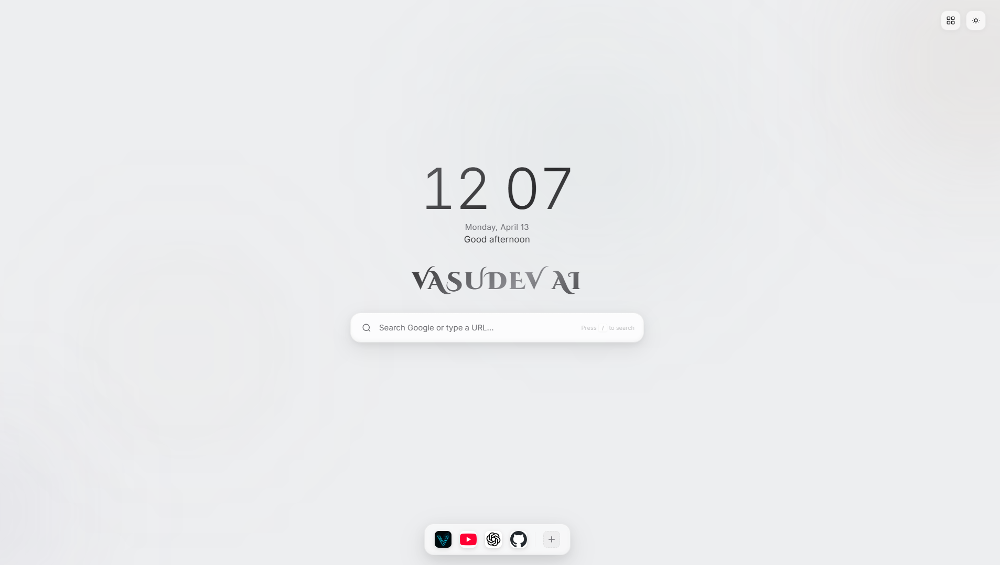
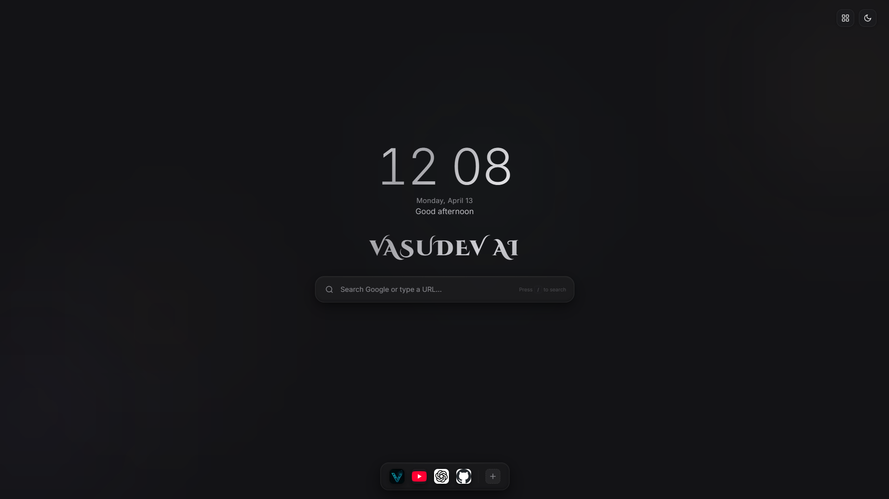

<div align="center">

# Minimal Tab By Vasudev AI

### A premium, minimal, Apple-style new tab experience for Chrome.

[](LICENSE)
[](https://github.com/sg-surya/custom-tabye)
[](https://developer.chrome.com/docs/extensions/mv3/)
[](https://vasudev.online)

<br/>

> Replace your boring Chrome new tab with a clean, beautiful, and functional dashboard - built with pure HTML, CSS & JavaScript.

<br/>



**[View Demo](http://search.vasudev.online/)** &middot; **[Report Bug](https://github.com/sg-surya/custom-tabye/issues)** &middot; **[Request Feature](https://github.com/sg-surya/custom-tabye/issues)**

</div>

---

## Preview

| Light Mode | Dark Mode |
|:----------:|:---------:|
|  |  |

---

## Features

- **Live Clock & Greeting** - Real-time clock with dynamic greeting based on time of day (Good morning, Good afternoon, Good evening, Good night).

- **Google Search with Omnibox** - Full search bar with live Google autocomplete suggestions. Type a URL and it navigates directly, or search Google instantly.

- **Dark / Light Theme** - Auto-detects system preference. Toggle manually anytime. Smooth animated transitions between themes.

- **Notes Widget** - Quick sticky notes that auto-save to local storage. Your notes persist across sessions.

- **Tasks Widget** - Minimal to-do list with checkboxes. Add tasks, mark them done, clear completed - all saved locally.

- **Calendar Widget** - Clean monthly calendar view with today highlighted.

- **Customizable Dock** - macOS-style dock at the bottom with your favorite websites. Add/remove sites easily with a modal dialog.

- **Keyboard Shortcuts** - Navigate the entire dashboard without touching your mouse.

- **3D Tilt & Animations** - Premium Apple-style micro-interactions: 3D tilt on search bar & dock, magnetic hover effects, ripple effects, smooth page transitions.

- **Animated Background** - Subtle floating gradient blobs that give the page a modern, alive feel.

- **Zero Dependencies** - No frameworks, no libraries, no build tools. Pure vanilla HTML, CSS, and JavaScript.

- **Privacy First** - No data collection, no analytics, no tracking. Everything is stored locally in your browser's `localStorage`.

---

## Keyboard Shortcuts

| Key | Action |
|:---:|--------|
| `/` | Focus search bar |
| `T` | Toggle Dark / Light theme |
| `W` | Toggle Widgets panel (Notes, Tasks, Calendar) |
| `Esc` | Close search / modal / unfocus |
| `Enter` | Search Google or navigate to URL |
| `Arrow Up / Down` | Navigate search suggestions |

---

## Tech Stack

| Technology | Purpose |
|:----------:|---------|
| **HTML5** | Structure & semantics |
| **CSS3** | Styling, animations, glassmorphism, gradients |
| **JavaScript** | All functionality (vanilla, no frameworks) |
| **Chrome Manifest V3** | Extension configuration |
| **Google Fonts** | Inter + Cinzel Decorative typography |
| **Google Suggest API** | Search autocomplete suggestions |

---

## Installation

### Method 1: Load Unpacked (Developer Mode)

1. **Download** this repository:
   ```bash
   git clone https://github.com/sg-surya/custom-tabye.git
   ```
   Or download as ZIP and extract it.

2. Open **Chrome** and go to:
   ```
   chrome://extensions
   ```

3. Enable **Developer Mode** (toggle in the top-right corner).

4. Click **"Load unpacked"** and select the `custom-tab` folder.

5. Open a **new tab** - your minimal dashboard is ready!

### Method 2: Download ZIP

1. Click the green **"Code"** button on this GitHub page.
2. Select **"Download ZIP"**.
3. Extract the ZIP file.
4. Follow steps 2-5 from Method 1 above.

---

## Project Structure

```
custom-tab/
├── manifest.json       # Chrome Extension config (Manifest V3)
├── index.html          # Main HTML - page structure
├── styles.css          # All styles, themes, animations
├── script.js           # All JavaScript functionality
├── icons/
│   ├── icon16.png      # Favicon (16x16)
│   ├── icon48.png      # Extension icon (48x48)
│   └── icon128.png     # Store/large icon (128x128)
├── screenshoots/
│   ├── light.png       # Light mode preview
│   └── dark.png        # Dark mode preview
├── LICENSE             # MIT License
└── README.md           # This file
```

---

## Contributing

Contributions are what make the open source community amazing. Any contributions you make are **greatly appreciated**.

1. **Fork** the repository
2. **Create** your feature branch
   ```bash
   git checkout -b feature/amazing-feature
   ```
3. **Commit** your changes
   ```bash
   git commit -m "Add: amazing feature"
   ```
4. **Push** to the branch
   ```bash
   git push origin feature/amazing-feature
   ```
5. **Open** a Pull Request

### Contribution Guidelines

- Keep it minimal and clean - no unnecessary libraries or dependencies.
- Follow the existing code style (vanilla JS, no frameworks).
- Test your changes in Chrome before submitting a PR.
- Write clear commit messages.

---

## Roadmap

Planned features for future releases:

- [ ] Weather widget with location-based forecasts
- [ ] Pomodoro / Focus timer widget
- [ ] Custom wallpaper / background image support
- [ ] Drag & drop dock reordering
- [ ] Bookmark folders integration
- [ ] Quick links grid customization
- [ ] Browser sync (Chrome Storage API) across devices
- [ ] Custom accent color picker
- [ ] Quotes / motivational text widget
- [ ] Multi-language support

> Got an idea? [Open an issue](https://github.com/sg-surya/custom-tabye/issues) and let us know!

---

## License

Distributed under the **MIT License**. See [`LICENSE`](LICENSE) for more information.

You are free to use, modify, and distribute this project. Just give credit where it's due.

---

<div align="center">

### Built with care by [Vasudev AI](https://vasudev.online)

**[vasudev.online](https://vasudev.online)** &middot; **[GitHub](https://github.com/sg-surya)**

If you found this useful, consider giving it a star!

</div>
